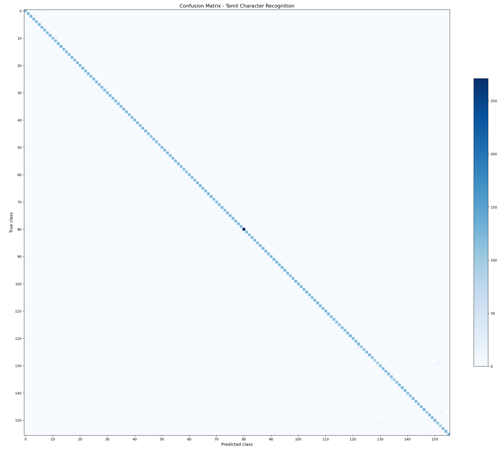
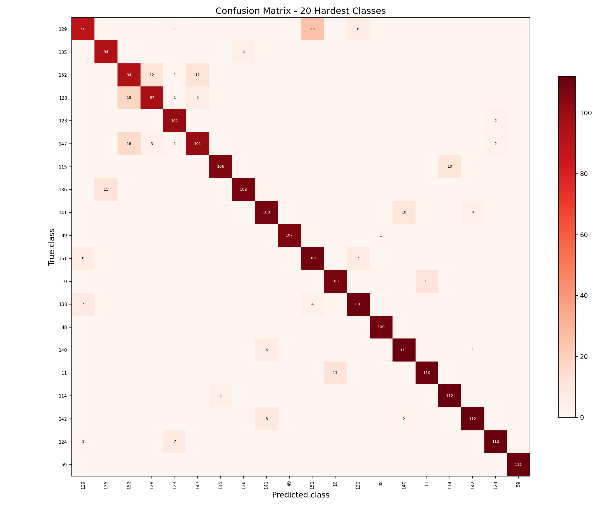
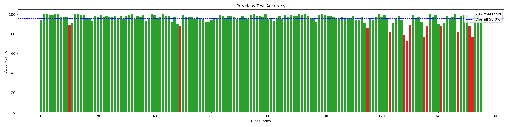
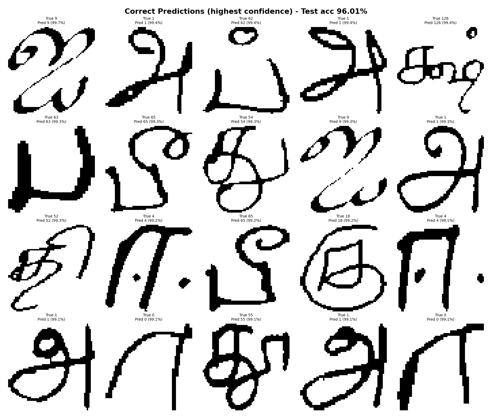
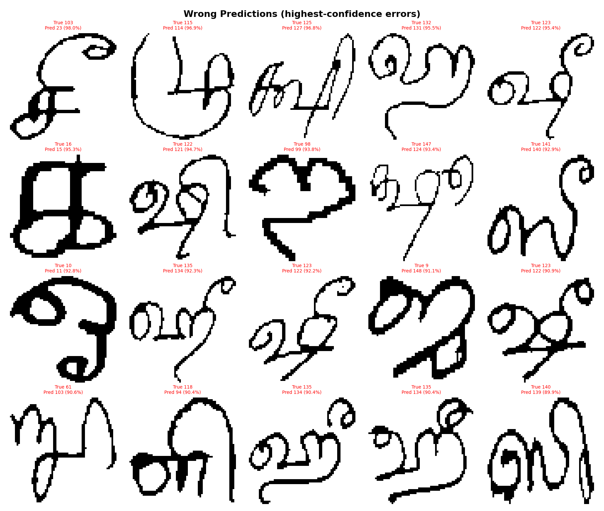

# Tamil Handwritten Character Recognition for Interactive Unicode Prediction

**Statistical Methods in AI**  
**Assignment 3, Theme T3.3: Tamil Characters**  
**Tier 1 Group Project**

## Abstract

In this project, we built a Tamil handwritten character recognition system and integrated it into an interactive web application. Our goal was to take a single handwritten Tamil character, provided either through a drawing canvas or an uploaded image, and predict its Unicode label with confidence scores. We trained a compact convolutional neural network from scratch on the uTHCD Tamil handwritten character dataset, which contains 156 classes. Using a clean train-validation-test protocol, our final model achieved `98.29%` validation accuracy and `96.01%` test accuracy. We also built a Streamlit-based interface that supports freehand drawing, image upload, practice mode, and sample predictions. Our results show that a lightweight CNN is sufficient for strong isolated-character recognition, while confusion-matrix analysis highlights that the remaining errors are concentrated in visually similar characters and subtle vowel-mark variations.

## 1. Introduction

Handwritten character recognition is an important problem in educational technology, document digitization, accessibility tools, and language computing. For Indian languages, the problem is especially meaningful because there are fewer polished interactive tools compared to English. Tamil script is a good example of a challenging recognition problem: many characters share a similar overall structure, and their differences may depend on small local stroke changes or short vowel marks.

For this assignment, we focused on recognizing a **single isolated Tamil handwritten character** and returning the correct Unicode label. In addition to training a classifier, we also built a usable application so that the system can be demonstrated in an interactive way. Our final app allows a user to:

- draw a Tamil character on a canvas,
- upload an image of a handwritten character,
- view the top predicted classes with confidence scores,
- practice writing a target character,
- test the model on stored sample examples.

This project fits well within the intended scope of Theme `T3.3`, where the emphasis is on building a small but complete machine learning application rather than only training a model offline.

## 2. Dataset

We used the **uTHCD Tamil handwritten character dataset** in its pre-split form. The dataset contains grayscale images of isolated handwritten Tamil characters along with integer class labels.

The dataset covers **156 classes**, which can be grouped into:

- `12` standalone vowels,
- `18` pure consonant forms,
- `126` consonant-vowel combinations.

The original dataset split contains:

- `71,760` training images,
- `19,190` test images.

To ensure that model selection was done cleanly, we further divided the original training portion into:

- `64,584` training images,
- `7,176` validation images.

This gave us a three-way split:

- training set: `64,584`
- validation set: `7,176`
- test set: `19,190`

All images are grayscale and were originally stored at `64 x 64` resolution.

## 3. Preprocessing and Augmentation

Before training, we applied a consistent preprocessing pipeline to every image:

1. convert pixel values to `float32`,
2. scale values to the range `[0, 1]`,
3. add a single-channel dimension,
4. resize the image from `64 x 64` to `32 x 32`,
5. normalize using statistics computed from the training split.

The normalization values used in the final run were:

- mean: `0.8013`
- standard deviation: `0.3990`

To improve generalization, we applied data augmentation only on the training set. The augmentations were intentionally mild so that they preserved the character identity:

- random rotation in the range `[-10°, +10°]`,
- random horizontal and vertical translation up to `10%`,
- random scaling in the range `[0.9, 1.1]`.

These augmentations help the model remain robust to variation in handwriting style, character placement, and stroke size.

## 4. Methodology

### 4.1 Model Architecture

We trained a custom convolutional neural network from scratch. The network is deliberately compact so that it remains easy to train, explain, and deploy within the assignment constraints.

The architecture consists of:

- three convolutional feature-extraction blocks,
- batch normalization after each convolution,
- ReLU activations,
- max-pooling for downsampling,
- dropout for regularization,
- a two-layer fully connected classifier at the end.

The final classifier predicts one of `156` classes. The network contains approximately **1.27 million trainable parameters**.

### 4.2 Training Setup

We trained the model using the following configuration:

- optimizer: `AdamW`
- learning rate: `0.001`
- weight decay: `1e-4`
- loss: cross-entropy with label smoothing `0.1`
- scheduler: cosine annealing
- batch size: `128`
- epochs: `20`
- validation split: `10%` of the original training partition
- random seed: `42`

Our final training run was completed on CPU, which keeps the project consistent with the low-compute expectation of a Tier 1 assignment.

## 5. Application Design

Alongside the model, we built a lightweight web application so that the classifier could be used interactively rather than only evaluated in a notebook.

The app contains four modes:

- **Draw and Predict:** users write a character directly on a canvas and request top-k predictions.
- **Practice Mode:** users are shown a target character and attempt to reproduce it.
- **Upload Image:** users submit an external handwritten image for classification.
- **Sample Demo:** users explore predictions on stored test examples.

We also paid attention to inference-time preprocessing. Freehand drawings from a canvas do not naturally match the dataset format, so we centered the written character, normalized the background, resized it to the expected input size, and then applied the same normalization used during training. This step was important for making the interactive demo behave consistently with the trained model.

## 6. Experimental Setup

For the final report, we used the retrained version of the model that follows a proper train-validation-test protocol. This is important because an earlier version of the pipeline evaluated directly on the test partition during training, which would not be appropriate for final reporting.

Our final evaluation therefore reflects:

- model selection using the validation split,
- final reporting on a separate held-out test set,
- consistent preprocessing between training and inference.

In addition to standard accuracy and classification metrics, we performed deeper analysis through:

- a full confusion matrix,
- a focused confusion matrix for the hardest classes,
- per-class accuracy analysis,
- qualitative inspection of high-confidence correct predictions,
- qualitative inspection of high-confidence incorrect predictions.

## 7. Results

### 7.1 Final Quantitative Performance

The final model achieved the following performance:

| Metric | Value |
| --- | ---: |
| Validation accuracy | `98.29%` |
| Validation loss | `0.9604` |
| Test accuracy | `96.01%` |
| Test loss | `1.0337` |
| Macro precision | `0.961` |
| Macro recall | `0.960` |
| Macro F1-score | `0.960` |
| Weighted F1-score | `0.960` |

These numbers indicate that the model generalizes well to unseen handwritten characters despite the large number of output classes.

### 7.2 Training Trend

Validation accuracy improved steadily over the course of training:

| Epoch | Train Accuracy | Validation Accuracy |
| ---: | ---: | ---: |
| 1 | `62.22%` | `92.07%` |
| 5 | `93.35%` | `96.99%` |
| 10 | `95.95%` | `97.80%` |
| 15 | `97.07%` | `98.10%` |
| 20 | `97.40%` | `98.29%` |

This pattern suggests that the model learned stable stroke-level features early and then refined them gradually over later epochs.

### 7.3 Interpretation of Performance

Three broad observations stand out from the final results:

1. A small CNN trained from scratch is already strong enough for this isolated-character recognition task.
2. Preprocessing consistency plays a major role, especially because real user inputs from a drawing canvas differ from the original dataset images.
3. The remaining errors are not uniformly distributed across classes. Instead, they are concentrated in a small group of visually similar characters.

## 8. Confusion Matrix and Error Analysis

Although the overall test accuracy is high, performance is not identical across all 156 classes. To understand the model’s behavior more deeply, we analyzed the full confusion matrix, the hardest classes, and per-class accuracy.

### 8.1 Full Confusion Matrix

*Figure 1. Full confusion matrix on the held-out test set.*

The full confusion matrix is strongly diagonal, which is consistent with the overall `96.01%` test accuracy. This means that for most classes, the model predicts the correct label far more often than any incorrect alternative. At the same time, the off-diagonal entries are not random. The visible error pockets suggest that certain groups of characters are systematically harder than others.

### 8.2 Hardest Classes

*Figure 2. Zoomed confusion matrix for the lowest-accuracy classes.*

When we focus only on the hardest classes, a more structured pattern appears. The model tends to confuse a difficult character with one or two specific alternatives rather than spreading errors widely across many classes. This is a useful result because it suggests that future improvements can be targeted toward specific ambiguous character groups.

### 8.3 Per-Class Accuracy

*Figure 3. Per-class accuracy on the held-out test set.*

Our per-class analysis shows that:

- `13` out of `156` classes fall below `90%` accuracy,
- most classes still remain above `90%`,
- the long tail of difficult classes is relatively small.

This tells us that the model is broadly reliable, but not equally confident across all character categories.

### 8.4 Hardest Individual Classes

The weakest classes on the test set, ranked by per-class accuracy, were:

| Class Index | Character | Precision | Recall | F1-score |
| ---: | --- | ---: | ---: | ---: |
| 129 | `னா` | `0.865` | `0.732` | `0.793` |
| 135 | `ங` | `0.870` | `0.764` | `0.814` |
| 152 | `ணீ` | `0.729` | `0.764` | `0.746` |
| 128 | `ன` | `0.858` | `0.789` | `0.822` |
| 123 | `றி` | `0.871` | `0.821` | `0.845` |
| 147 | `ஞூ` | `0.856` | `0.821` | `0.838` |

These classes are difficult largely because they contain subtle visual distinctions. In several cases, the character identity depends on a small mark, stroke curvature, or vowel attachment rather than a large change in global shape.

### 8.5 Strongest Confusion Pairs

The strongest confusion pairs on the test set were:

| True Class | Predicted As | Error Count | Per-class Error Rate |
| --- | --- | ---: | ---: |
| `129: நா` | `151: ணி` | `25` | `20.3%` |
| `135: ங` | `134: னெ` | `24` | `19.5%` |
| `123: றி` | `122: றா` | `19` | `15.4%` |
| `128: ன` | `152: ணீ` | `18` | `14.6%` |
| `147: ஞூ` | `152: ணீ` | `16` | `13.0%` |

These are structured confusions rather than random mistakes. The model most often fails when:

- two classes share a similar base character skeleton,
- the distinguishing signal is a small vowel marker,
- downsampling reduces the visibility of fine-grained details,
- handwriting variation causes two already-similar characters to overlap further.

### 8.6 Qualitative Prediction Analysis

*Figure 4. High-confidence correct predictions.*

The correct-prediction grid shows that the model is very stable when the handwritten character is well-centered and its defining strokes are clear. In these cases, the network assigns high confidence to the correct class and maintains strong separation from other labels.

*Figure 5. High-confidence incorrect predictions.*

The wrong-prediction grid is more revealing. Many of these mistakes are made with strong confidence, which suggests that the confusing character pairs are genuinely similar under the current resolution and preprocessing pipeline. This indicates that simply training longer may not be enough to solve the remaining errors. Better gains may come from higher-resolution inputs, targeted augmentation, or explicit handling of visually similar classes.

## 9. Ablation Note

This is a Tier 1 project, so our objective was to build a strong and complete baseline system rather than run a large architecture comparison. We therefore did not perform a full multi-model ablation study.

However, we still made one important methodological improvement during the project: we moved to a proper train-validation-test setup and used that cleaner pipeline for final reporting. In practical terms, this was the most meaningful experimental correction because it made the reported results more trustworthy.

If we were to extend this work further, the most useful ablations would likely be:

- input resolution (`32 x 32` versus larger inputs),
- stronger or confusion-aware augmentation,
- deeper CNN variants or residual architectures,
- targeted treatment of visually similar character subsets.

## 10. Limitations

Our system has a few clear limitations:

- it recognizes only **single isolated characters**, not full words or handwritten lines,
- some visually similar classes remain difficult,
- the prediction quality depends on preprocessing quality, especially centering and scale normalization,
- the app has been evaluated locally and functionally, but not benchmarked for low-resource deployment scenarios,
- we do not include writer-specific generalization analysis in this report.

These limitations do not reduce the usefulness of the current system as a demonstration project, but they do define the most natural directions for improvement.

## 11. Future Work

There are several ways we could extend this project:

- train at a higher image resolution to preserve fine stroke details,
- design augmentation specifically for confusing character groups,
- expand from character recognition to word-level Tamil OCR,
- collect real user-drawn samples from the application and use them for further fine-tuning,
- package the model for lighter deployment on mobile or browser-based systems.

## 12. Conclusion

In this project, we built a complete Tamil handwritten character recognition pipeline and deployed it as an interactive application. Our model achieved `96.01%` test accuracy across `156` classes, which is a strong result for a lightweight system trained from scratch under the assignment’s compute constraints.

More importantly, the project goes beyond raw accuracy. Through the application interface and the confusion-matrix analysis, we were able to study not only when the model succeeds, but also where it still struggles. The overall outcome is a practical and technically sound Tier 1 machine learning application that is easy to demonstrate, analyze, and explain.

## 13. References

1. **SMAI Assignment 3: Build a Real ML App.** Course handout, Academic Year 2025-26.
2. **uTHCD Tamil Handwritten Character Dataset.** Kaggle dataset used for Tamil handwritten character recognition.
3. **PyTorch Documentation.** Used for model building, optimization, and training.
4. **Streamlit Documentation.** Used for the web application interface.
5. **scikit-learn Documentation.** Used for evaluation metrics and confusion-matrix analysis.

## 14. Acknowledgements

We used LLM assistance for report drafting and editing. All experiments, metrics, figures, and conclusions reported here were checked against our project outputs by the group.
